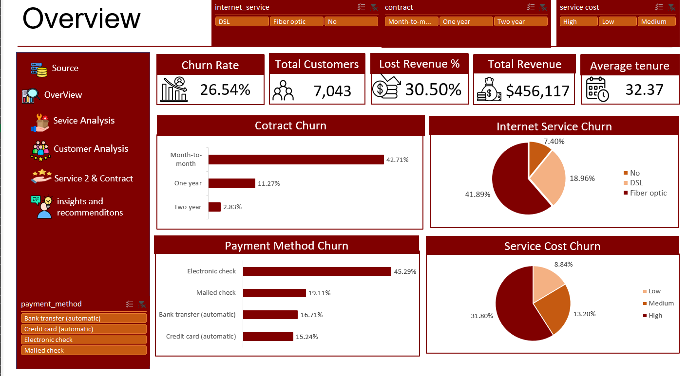

# Telecom Customer Churn Analysis

An end-to-end customer churn analysis for a telecom company, built **100% in Excel** — from raw data cleaning to an interactive multi-page dashboard.

## 📌 Overview

This project analyzes customer churn behavior across ~7,000 telecom customers to identify the key drivers behind customer loss and provide actionable business recommendations to improve retention.

**Overall Churn Rate:** 26.54%
**Total Customers:** 7,043
**Total Revenue:** $456,117
**Lost Revenue:** 30.50%

## 🛠 Tools Used

- **Excel** (Power Query, Power Pivot, DAX)
- **Pivot Tables & Charts**
- **Data Modeling** (Star Schema: Fact & Dimension tables)

## 🔄 Process

1. **Data Cleaning & Transformation**
   Loaded raw data into Power Query, handled duplicates, missing values, and outliers, and standardized fields for consistency.

2. **Data Modeling**
   Split the dataset into a Fact table (`fact_churn`) and multiple Dimension tables (customers, contract, payment, core services, additional services) following a star schema design.

3. **DAX Measures**
   Built core measures in Power Pivot, including Total Customers, Total Revenue, Churn Rate, and Lost Revenue %.

4. **Dashboard Design**
   Created a multi-page interactive dashboard covering:
   - **Overview** — high-level KPIs and churn by contract/payment/internet service
   - **Service Analysis** — churn by support and protection services
   - **Customer Analysis** — churn by demographics (gender, senior citizens, partners, dependents)
   - **Service & Contract** — churn by streaming services and billing type
   - **Key Insights** — summarized business findings

## 🔑 Key Insights

- **Month-to-month contracts** have by far the highest churn rate (**42.71%**) compared to one-year (11.27%) and two-year (2.83%) contracts.
- **Fiber Optic** customers churn the most (**41.89%**), likely linked to both higher pricing and service quality.
- **Electronic Check** users show the highest churn among all payment methods (**45.29%**).
- Customers without **Tech Support, Online Security, or Device Protection** churn up to **3x more** than those with these services.
- **Senior Citizens** churn at nearly **2x** the rate of other customers (41.68% vs 23.61%).
- **Paperless Billing** users churn at almost double the rate of traditional billing customers (33.57% vs 16.33%).
- Streaming TV and Streaming Movies show minimal impact on churn compared to contract type, pricing, and support services.

## 💡 Recommendations

1. **Contract Upgrades** — Offer discounts to move Month-to-month customers to 1–2 year contracts.
2. **Payment Method Fix** — Investigate issues with Electronic Check payments and encourage automatic payment methods.
3. **Fiber Optic Quality & Pricing** — Audit technical performance and review pricing for Fiber Optic service.
4. **Free Support Add-ons** — Offer Tech Support, Online Security, and Device Protection at low/no cost to boost retention.
5. **Senior Citizen Care** — Build targeted retention programs for senior customers.
6. **Traditional Billing Offer** — Give Paperless Billing customers the option to switch back to paper billing to improve engagement.

## 📊 Dashboard Preview


## 📁 Repository Structure

```
├── WA_Fn-UseC_-Telco-Customer-Churn/               # Raw dataset
├── teleco_customer_churn_analysis/          # Excel file with full dashboard
├── screenshots/        # Dashboard page previews
└── README.md
```

